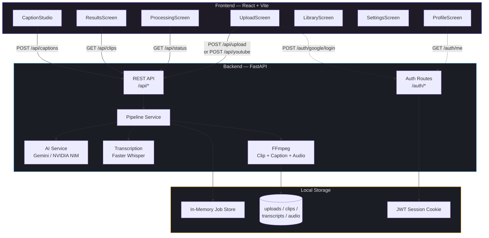
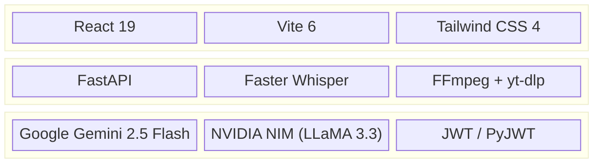
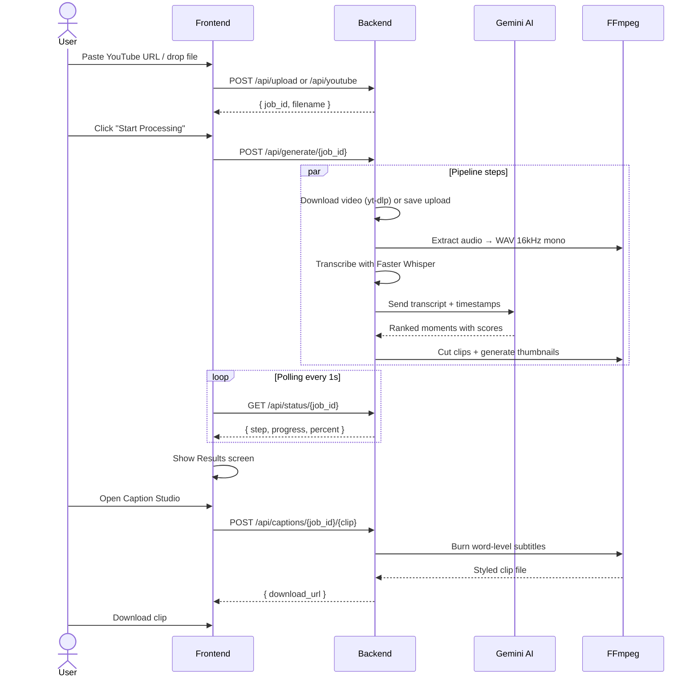
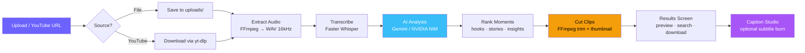
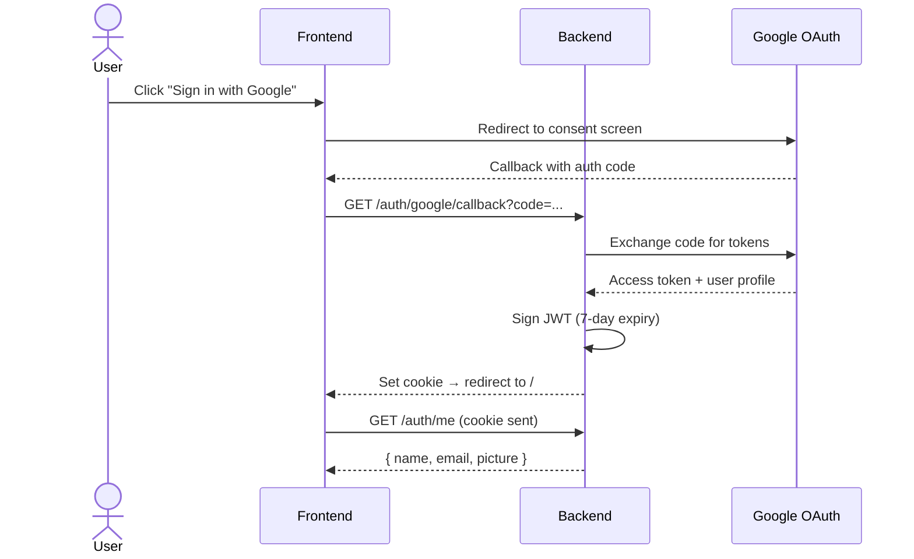

# Clipo AI

> **Turn long videos into scroll-stopping short clips with AI.**

Clipo is a local-first AI clip studio that ingests long-form video — uploaded files or YouTube URLs — transcribes speech, finds the highest-retention moments, and exports social-ready clips with one-click styled captions.

---

## Table of Contents

- [Architecture](#architecture)
- [Features](#features)
- [Tech Stack](#tech-stack)
- [Demo Flow](#demo-flow)
- [Prerequisites](#prerequisites)
- [Quick Start](#quick-start)
- [Project Structure](#project-structure)
- [How the Pipeline Works](#how-the-pipeline-works)
- [Authentication Flow](#authentication-flow)
- [API Reference](#api-reference)
- [Environment Variables](#environment-variables)
- [GPU / CUDA Setup](#gpu--cuda-setup)
- [Troubleshooting](#troubleshooting)

---

## Architecture



---

## Features

| Feature | Description |
|---------|-------------|
| **Multi-input** | Upload MP4, MOV, MKV, AVI, or paste a YouTube URL |
| **Whisper transcription** | Local speech-to-text with word-level timestamps (Faster Whisper) |
| **AI moment detection** | Gemini or NVIDIA NIM finds hooks, stories, insights, and emotional beats |
| **Auto clip generation** | FFmpeg cuts and exports the best moments as short clips |
| **Caption Studio** | Interactive phone preview with styled presets: Classic, Neon, Bold, Minimal |
| **Google OAuth** | One-click Google login, JWT session cookie |
| **Job library** | Track, revisit, and manage all past jobs from a central library |
| **Settings dashboard** | See AI provider status, system info, and session details |

---

## Tech Stack



| Layer | Technology |
|-------|------------|
| Frontend | React 19, Vite 6, Tailwind CSS 4, React Router |
| Backend | FastAPI, Uvicorn, Pydantic, PyJWT |
| Transcription | Faster Whisper (CTranslate2) — auto-detects GPU |
| AI Analysis | Google Gemini 2.5 Flash (default) or NVIDIA NIM |
| Video Processing | FFmpeg, yt-dlp |
| Auth | Google OAuth 2.0, JWT session cookie (7-day expiry) |

---

## Demo Flow



---

## Prerequisites

> **FFmpeg is required.** The server exits immediately at startup with install instructions if FFmpeg is not found on your PATH.

| Requirement | Version | Notes |
|-------------|---------|-------|
| Python | 3.10+ | |
| Node.js | 18+ | |
| FFmpeg | 6.0+ | See [install guide](#installing-ffmpeg) below |
| Gemini API key | — | [Get one here](https://aistudio.google.com/apikey) |
| NVIDIA GPU (optional) | CUDA 12+ | 5–10x faster transcription |

### Installing FFmpeg

```bash
# macOS (Homebrew)
brew install ffmpeg

# Ubuntu / Debian
sudo apt update && sudo apt install ffmpeg

# Fedora / RHEL
sudo dnf install ffmpeg

# Windows (winget)
winget install ffmpeg

# Windows (Chocolatey)
choco install ffmpeg

# Arch Linux
sudo pacman -S ffmpeg
```

Verify:

```bash
ffmpeg -version
# ffmpeg version 7.x …
```

---

## Quick Start

### 1. Clone

```bash
git clone https://github.com/SACHINN122/clipo.git
cd clipo
```

### 2. Backend

```bash
cd backend
python -m venv venv
source venv/bin/activate        # macOS / Linux
# .\venv\Scripts\Activate.ps1  # Windows PowerShell

pip install -r requirements.txt
```

Create `backend/.env`:

```env
GEMINI_API_KEY=your_key_here

# Optional: use NVIDIA NIM instead of Gemini
# AI_PROVIDER=nvidia
# NVIDIA_API_KEY=your_nvidia_key

# Optional: Google OAuth login
# GOOGLE_CLIENT_ID=your_client_id
# GOOGLE_CLIENT_SECRET=your_client_secret
# FRONTEND_URL=http://localhost:5173
# BACKEND_URL=http://localhost:8001
```

### 3. Frontend

```bash
cd frontend
npm install
npm run dev          # → http://localhost:5173
```

### 4. Run

```bash
cd backend
python main.py       # → http://localhost:8001
```

Open **http://localhost:5173** in your browser.

---

## Project Structure

```
clipo/
├── backend/
│   ├── routes/
│   │   ├── api.py              # REST endpoints (upload, generate, clips, captions)
│   │   └── auth.py             # Google OAuth login / callback / session
│   ├── services/
│   │   ├── upload_service.py   # File upload handling
│   │   ├── youtube_service.py  # YouTube download via yt-dlp
│   │   ├── audio_service.py    # FFmpeg audio extraction
│   │   ├── transcription_service.py  # Faster Whisper STT
│   │   ├── ai_service.py       # Gemini / NVIDIA moment detection
│   │   ├── clip_service.py     # FFmpeg clip generation
│   │   ├── caption_service.py  # FFmpeg subtitle burning
│   │   └── pipeline_service.py # Job orchestration
│   ├── models/
│   │   └── schemas.py          # Pydantic request/response models
│   ├── main.py                 # FastAPI entry point + startup checks
│   ├── config.py               # All env vars + defaults
│   └── requirements.txt
│
├── frontend/
│   ├── src/
│   │   ├── components/
│   │   │   ├── UploadScreen.jsx      # File / YouTube upload
│   │   │   ├── ProcessingScreen.jsx  # Live step progress
│   │   │   ├── ResultsScreen.jsx     # Clip gallery + search
│   │   │   ├── CaptionStudio.jsx     # Styled caption editor
│   │   │   ├── VideoPlayer.jsx       # Fullscreen clip preview
│   │   │   ├── StudioHeader.jsx      # Nav bar + user menu
│   │   │   ├── LoginScreen.jsx       # Google sign-in
│   │   │   ├── ProfileScreen.jsx     # User profile
│   │   │   ├── LibraryScreen.jsx     # Past jobs history
│   │   │   ├── SettingsScreen.jsx    # System config display
│   │   │   ├── AuthCallback.jsx      # OAuth redirect handler
│   │   │   ├── ProtectedRoute.jsx    # Auth guard
│   │   │   └── ClipoMark.jsx        # SVG brand mark
│   │   ├── contexts/
│   │   │   └── AuthContext.jsx       # Auth state provider
│   │   ├── lib/
│   │   │   ├── api.js               # API client (fetch + error handling)
│   │   │   ├── auth.js              # OAuth helpers
│   │   │   └── notifications.js     # Browser notification API
│   │   ├── App.jsx                   # Screen router + state
│   │   ├── main.jsx                  # React root
│   │   └── index.css                 # Tailwind + custom styles
│   ├── package.json
│   └── vite.config.js
│
├── uploads/          # Original video files (auto-created)
├── clips/            # Generated short clips
├── transcripts/      # Whisper transcription JSON
├── audio/            # Extracted audio WAVs
└── temp/             # Temporary processing files
```

---

## How the Pipeline Works



### Processing Steps

| Step | What happens | Tool |
|------|-------------|------|
| **Download** | YouTube URL fetched via yt-dlp, or file saved to disk | yt-dlp / upload_service |
| **Extract audio** | Video → 16kHz mono WAV (optimal for Whisper) | FFmpeg |
| **Transcribe** | Speech-to-text with word-level timestamps | Faster Whisper (CTranslate2) |
| **AI analysis** | Transcript + timestamps sent to Gemini/NVIDIA for moment ranking | Gemini 2.5 Flash |
| **Cut clips** | Each ranked moment trimmed to a standalone clip with thumbnail | FFmpeg |
| **Caption burn** | Word-level subtitles burned onto clips with styled presets | FFmpeg + libass |

---

## Authentication Flow



**Key fix:** The cookie `secure` flag is now conditional — it works on both HTTP localhost and HTTPS production.

---

## API Reference

| Method | Endpoint | Description |
|--------|----------|-------------|
| `POST` | `/api/upload` | Upload a video file and create a job |
| `POST` | `/api/youtube` | Create a job from a YouTube URL |
| `POST` | `/api/generate/{job_id}` | Start the processing pipeline |
| `GET` | `/api/status/{job_id}` | Live job status and step progress |
| `GET` | `/api/clips/{job_id}` | List completed clips for a job |
| `GET` | `/api/caption-styles` | List available subtitle presets |
| `POST` | `/api/captions/{job_id}/{clip_id}` | Burn word-level captions into a clip |
| `GET` | `/api/download/{job_id}/{filename}` | Download an exported clip |
| `GET` | `/api/config` | Public system config (AI providers, upload limits) |
| `GET` | `/api/health` | Backend health check |
| `GET` | `/auth/google/login` | Redirect to Google OAuth consent |
| `GET` | `/auth/google/callback` | OAuth callback — exchange code, set cookie |
| `GET` | `/auth/me` | Get current authenticated user |
| `POST` | `/auth/logout` | Clear session cookie |

Full interactive docs at **http://localhost:8001/docs** (Swagger UI).

---

## Environment Variables

All settings are read from `backend/.env`. Defaults work out of the box for local dev.

### Core

| Variable | Default | Description |
|----------|---------|-------------|
| `GEMINI_API_KEY` | `""` | **Required.** Your Gemini API key |

### AI Provider

| Variable | Default | Description |
|----------|---------|-------------|
| `AI_PROVIDER` | `""` | `gemini` (default) or `nvidia` — auto-detects based on available keys |
| `NVIDIA_API_KEY` | `""` | NVIDIA NIM API key (only if using `AI_PROVIDER=nvidia`) |
| `NVIDIA_NIM_BASE_URL` | `https://integrate.api.nvidia.com/v1` | NIM endpoint |
| `NVIDIA_NIM_MODEL` | `nvidia/llama-3.3-70b-instruct` | Model for NIM |

### Whisper / Transcription

| Variable | Default | Description |
|----------|---------|-------------|
| `WHISPER_MODEL` | `small` | `base`, `small`, `medium`, `large-v1/v2/v3` |
| `WHISPER_DEVICE` | auto | `cuda` or `cpu` — auto-detects GPU |
| `WHISPER_COMPUTE_TYPE` | auto | `float16` (GPU) or `int8` (CPU) |

### Auth

| Variable | Default | Description |
|----------|---------|-------------|
| `GOOGLE_CLIENT_ID` | `""` | Google OAuth client ID |
| `GOOGLE_CLIENT_SECRET` | `""` | Google OAuth client secret |
| `FRONTEND_URL` | `http://localhost:5173` | Where to redirect after OAuth |
| `BACKEND_URL` | `http://localhost:8001` | Backend URL for OAuth redirect_uri |
| `JWT_SECRET` | random | Secret for signing JWT tokens |

### Retry / Resilience

| Variable | Default | Description |
|----------|---------|-------------|
| `GEMINI_MAX_RETRIES` | `4` | Retry attempts for API failures |
| `GEMINI_RETRY_BASE_SECONDS` | `2.0` | Base delay before retry |
| `GEMINI_RETRY_MAX_SECONDS` | `30.0` | Maximum retry delay |

### YouTube Downloads

| Variable | Default | Description |
|----------|---------|-------------|
| `MAX_YOUTUBE_DURATION` | `10800` (3h) | Max video length in seconds |
| `YOUTUBE_COOKIES_FILE` | `""` | Path to `cookies.txt` exported from your browser |

> **Exporting YouTube cookies** — yt-dlp may hit a "Sign in to confirm you're not a bot" wall.
> To work around it, install a browser extension like *Get cookies.txt* (Chrome/Firefox),
> log in to youtube.com, export the cookies, and set `YOUTUBE_COOKIES_FILE` to that file.
> The backend uses it before falling back to anonymous extraction strategies.

### Performance Tips

- **Low VRAM GPU:** `WHISPER_MODEL=small` + `WHISPER_COMPUTE_TYPE=float16`
- **Best accuracy:** `WHISPER_MODEL=large-v3` on GPU
- **CPU-only:** `WHISPER_DEVICE=cpu` + `WHISPER_COMPUTE_TYPE=int8`

---

## GPU / CUDA Setup

> **Optional but recommended.** GPU transcription is 5–10x faster than CPU.

```bash
# 1. Install NVIDIA drivers
# Download from https://www.nvidia.com/Download/index.aspx
nvidia-smi   # verify

# 2. Install CUDA Toolkit
# Download from https://developer.nvidia.com/cuda-downloads

# 3. Install cuDNN
# Download from https://developer.nvidia.com/rdp/cudnn-download

# 4. Verify PyTorch sees the GPU
python -c "import torch; print(torch.cuda.is_available())"
# → True

# 5. Confirm .env
WHISPER_DEVICE=cuda
WHISPER_COMPUTE_TYPE=float16
```

---

## Troubleshooting

<details>
<summary><strong>FFmpeg not found / server exits at startup</strong></summary>

Clipo requires FFmpeg on your PATH. The server checks at startup and exits with install instructions if missing.

```bash
# macOS
brew install ffmpeg

# Ubuntu
sudo apt install ffmpeg

# Windows
winget install ffmpeg
```

</details>

<details>
<summary><strong>Gemini API errors / quota exceeded</strong></summary>

The backend retries Gemini failures up to `GEMINI_MAX_RETRIES` times with exponential backoff. If you're hitting quota limits:

1. Check your usage at https://aistudio.google.com
2. Try a smaller `WHISPER_MODEL` to reduce transcript size sent to Gemini
3. Set `AI_PROVIDER=nvidia` and provide `NVIDIA_API_KEY` as a fallback

</details>

<details>
<summary><strong>Backend won't start — port already in use</strong></summary>

```bash
# Find and kill the process on port 8001
lsof -ti:8001 | xargs kill -9
```

</details>

<details>
<summary><strong>Cookies not being sent / auth not working</strong></summary>

- Ensure you're accessing the frontend at the URL in `FRONTEND_URL` (default `http://localhost:5173`)
- The backend must be at `BACKEND_URL` (default `http://localhost:8001`)
- On localhost the JWT cookie uses `Secure=false` (HTTP). On production it requires HTTPS.

</details>

<details>
<summary><strong>Processing stuck or jobs disappear</strong></summary>

Jobs are held in-memory. Restarting the backend clears all job state. For persistent storage, the job store would need to be swapped for a database (not yet implemented).

</details>

---

## Notes

- This project is intended for **local development and personal use**
- Processing time varies with source duration, hardware, and API latency
- YouTube downloads respect the 3-hour maximum duration limit
- Maximum upload size: 5 GB

---

**Made with care — [SACHINN122](https://github.com/SACHINN122)**
